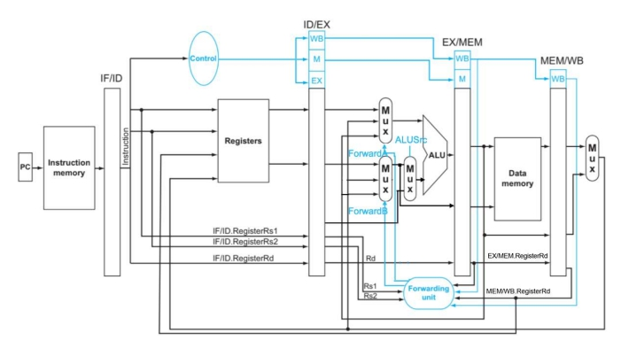

# Pipelined CPU

## Introduction
Compared to a single-cycle CPU, a pipelined CPU is more efficient in using
hardware resources. To achieve the efficiency, it divides each instruction into several
stages, and leaves spare hardware resources to the following instructions. However, if
an instruction uses a register updated by a previous instruction, something wrong might
happen. Luckily, by using a forwarding unit to check the data dependency, we can easily
avoid that tragedy.

In this homework, you are asked to revise your single-cycle CPU into a pipelined
CPU with a forwarding unit as shown below.
## Problem Description
### Architecture

(Note that the sign-extended immediate, ALU control and branch logic are not shown.
You have to finish them with the architecture pictures in lecture PPTs.) 

### Input
A sequence of instructions in binary is given as the input. The instruction set
contains ADD, SUB, AND, OR, SLT, SLTI, ADDI, LD, SD and BEQ. To
simplify the implementation, instruction BEQ will be always “not taken”, and
instruction LD will not cause hazard problems.

### Predefined files (do NOT modify them):
The files below are given to you, but you don’t need to hand them in. TAs
will use the default version to verify your implementation’s correctness. In other
words, any modification will NOT take effect.
1. Data_Mem.v
2. Instr_Mem.v
3. Pipe_Reg.v
4. Program_Counter.v
5. Reg_File.v

### Predefined files (TODO):
The files below are templates. Their input and output ports are predefined,
and what you have to finish are the computations in each module and the
connections among the modules.
1. Adder.v 
2. ALU.v
3. ALU_Ctrl.v 
4. Control.v
5. MUX_2to1.v 
6. MUX_3to1.v
7. Shift_Left_One_64.v 
8. Imm_Gen.v
9. Forwarding_Unit.v 
10. Pipe_CPU.v (top module) 

### Output and testbench:
By using makefile to run all your Verilog files with testbench.v, the
console will show all the registers’ values in the end. We will check the clock
cycle counts of your pipelined CPU to make sure the CPU is a pipelined version.

## Language/Platform

    Language: Verilog
    Platform: Unix/Linux

## Required Items
Do NOT compress your files! Please upload the 10 .v files (TODO) to iLMS.
1. Adder.v 
2. ALU.v
3. ALU_Ctrl.v 
4. Control.v
5. MUX_2to1.v 
6. MUX_3to1.v
7. Shift_Left_One_64.v 
8. Imm_Gen.v
9. Forwarding_Unit.v 
10. Pipe_CPU.v (top module) 
Do NOT add/modify any clock or rst settings in your Verilog code, for example,
#delay. 
Do NOT modify any filename. 
Do NOT use $stop in your Verilog code. 
Any violations will cause strong penalties!

## How to RUN
1. Go to testbench.v change the test file location
2. Use the makefile to run it